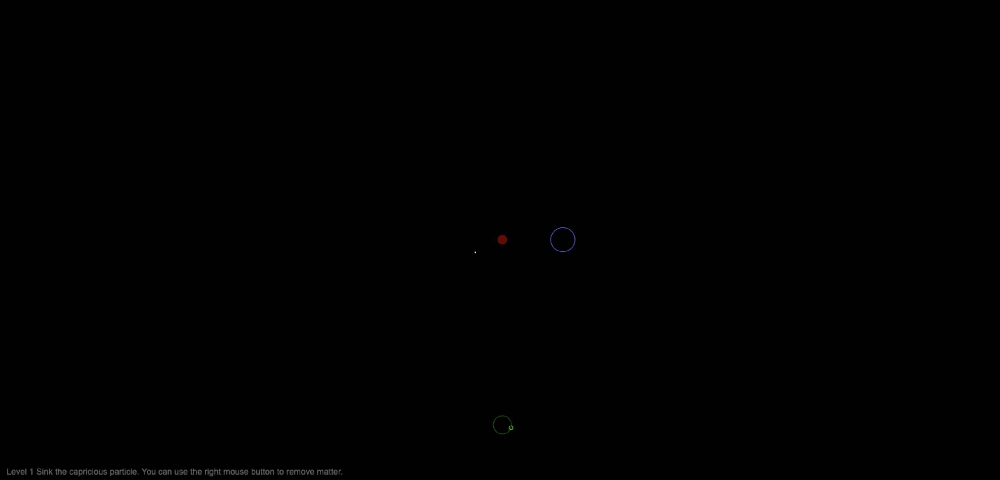

# deusnovum

Deus Novum is an HTML5/JS game that lets you take control of a Universe - manipulate time, space and physics to complete challenges.

Try it out online:

https://dwmkerr.github.io/deusnovum/

## Developer Guide

This is very much a basic work in progress and it's been years since I've worked on it! Feel free to play with it or experiment.

This is pure HTML/JS, there are no frameworks used.

When a change is pushed to the `master` branch the GitHub Pages site will automatically be updated.
